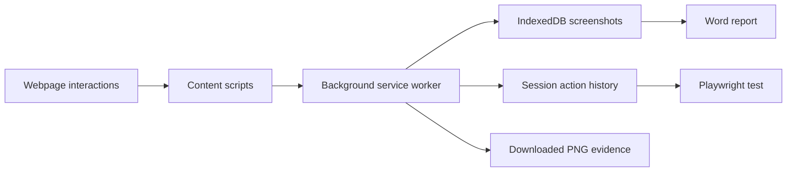

# Browser Test Evidence Recorder

A browser extension that turns manual web testing into screenshot evidence, simple Word reports, and replayable Playwright tests.

Built with **JavaScript**, **Chrome Manifest V3**, **IndexedDB**, and **Playwright**. The extension runs locally without a backend or external AI service.

## The problem it solves

Manual testers often repeat three tasks: capture screenshots, assemble evidence documents, and translate their browser actions into automation. This project brings those tasks into one session-based workflow.

## Features

| Feature | What it does |
| --- | --- |
| Screenshot capture | Automatic capture on clicks/page loads, or manual capture with **S + click** and **Alt+S** |
| Test sessions | Groups evidence by session and Test Case ID |
| Word export | Creates a local `.docx` containing page titles and screenshots |
| Playwright export | Converts recorded actions into a `.spec.js` test |
| Form recording | Captures typing, selects, checkbox/radio changes, uploads, and keyboard submission |
| Browser workflows | Handles tabs, popups, frames, open shadow DOM, redirects, and SPA navigation |
| Local storage | Stores image data in IndexedDB and lightweight metadata in browser storage |

## Try it locally

1. Download this repository using **Code → Download ZIP**, then extract it, or clone it:

   ```sh
   git clone https://github.com/rkdian100/browser-test-evidence-recorder.git
   ```

2. Open `chrome://extensions` in Chrome or `edge://extensions` in Edge.
3. Enable **Developer mode**, choose **Load unpacked**, and select the folder containing `manifest.json`.
4. Refresh the webpages you want to record, open the extension, and start a **New Session**.
5. Enter a Test Case ID and choose Automatic or Manual screenshot capture.
6. Perform a test workflow, then export a Word report or Playwright script.

The extension requires no build step. Node.js is needed only to run development tests or exported Playwright tests. Automated browser verification currently uses Chromium/Chrome; Edge compatibility has not been separately verified.

### Recording controls

- **Automatic:** captures screenshots on clicks and page loads.
- **Manual:** hold **S** outside text fields and click, or press **Alt+S**. The click still performs its normal page action.
- **Pause:** stops both screenshot capture and Playwright action recording.
- Playwright actions are recorded in both screenshot modes while recording is enabled.
- Captures contain the visible viewport, not the full scrolling page.

## How it works



| Component | Responsibility |
| --- | --- |
| `content.js` | Screenshot triggers and keyboard shortcuts |
| `action-recorder.js` | Records interactions and selects element locators |
| `background.js` | Coordinates capture, messages, sessions, and exports |
| `workflow-store.js` | Serializes and persists the current action history |
| `playwright-export.js` | Generates standalone Playwright Test source |
| `evidence-db.js` | Stores screenshot data in IndexedDB |
| `docx-report.js` | Builds DOCX files locally without a document service |
| `popup.*` / `viewer.*` | Recorder controls and evidence viewers |

### Engineering choices

- Action recording is independent of screenshot capture, so screenshot timing and retention do not remove replay steps.
- Password fields become required environment variables rather than literal passwords in exported scripts.
- Locator generation prefers unique test attributes, labels, and roles; structural selectors are marked for review.
- Action-triggered navigation is asserted instead of bypassed with an extra `goto()`.
- Popup listeners are registered before the action that opens the window.
- Pending edits are flushed before pause and export.

## Verification

```sh
npm install
npx playwright install chromium
npm test
npm run test:browser
```

The tests cover capture modes, storage, session boundaries, secret omission, exports, and script syntax. The browser harness records real interactions against a local fixture, generates a script, and replays it in a fresh browser context.

A 36-action fixture covers two login flows, text editing, selects, checkboxes, radio buttons, uploads, frames, shadow DOM, popup/independent tabs, double-clicks, reload, back, and forward. The harness supplies an extension messaging/storage bridge; it does not install the extension into a real browser profile or validate arbitrary production applications.

See [Playwright setup and supported workflows](PLAYWRIGHT.md) for running exported tests.

## Data and permissions

The extension records the webpages you interact with while recording is enabled. It requests broad website access to support testing across applications. It uses browser storage, tabs/navigation events, and downloads for local recording and export. There is no application backend or upload service in this project.

Ordinary typed values and URLs are retained locally. Recognized password, token, and similar sensitive fields omit their typed values from the action history, but this is not comprehensive redaction: screenshots still contain visible page content. Use test accounts and review evidence before sharing it.

- The latest **100 screenshots** are retained across sessions; downloaded PNG files remain after eviction.
- The current session retains up to **5000 actions**. Incomplete recordings fail export explicitly.
- **New Session** replaces the current action history. Export it first if needed.
- **Clear** removes stored evidence and actions, while keeping downloaded files.
- Generated recordings, traces, authentication files, and local secrets are excluded from Git.

## Limitations

MFA/CAPTCHA, native desktop apps, closed shadow roots, drag-and-drop, hover-only menus, and JavaScript dialog responses require application-specific work. Dynamic URLs, ambiguous frames, and changing UI structures may require edits to generated tests. Add business assertions for outcomes such as saved records or successful transactions.

This is a portfolio project and development tool, not a guarantee that every web workflow can be replayed without changes.
